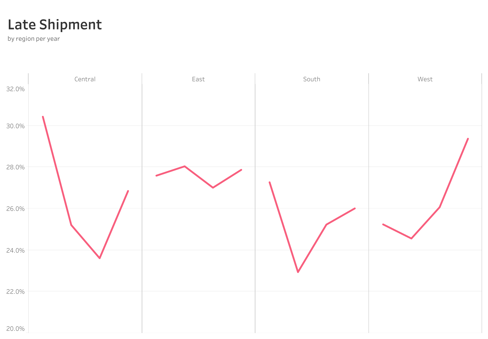

# Retail-Store-Data-Analysis
## Project Background
The data set used for data analysis contains sales records of four years (from 2021 till 2024) of a retail store. The data is narrowed down to USA only to presents a comprehensive data analysis of this region & showcase it's performance across key business metrics including sales, profits, shipment efficiency, customer retention, orders and discount impact. It features insights into sales growth trends, product performance, customer acquisition and shipment trend. It concludes with recommendations to enhance growth in sales, profits and customer retention.
## Executive Summary
Profit analysis for this store shows a steady increase year-over-year. However, the profit growth rate was at it's peak in 2023 at 32%. Canon advanced copier being the top product with the most profit, shows 225% more profit than the very next product in line, a plastic comb binding machine. West and East regions remained the top 2 regions with highest sales throughout the years. Their contribution is approximately 32% and 30% to the total sales, respectively. However, It remained difficult for the business to attract new and retain existing customers over the years. The new and repeat customers ratios declined by 20% and 80%, respectively from its starting year. 
For a comprehensive business overview, you can explore the interactive tableau dashboard <a href="https://public.tableau.com/views/RetailShop-ExecutiveSummary/ExecutiveSummary?:language=en-GB&:sid=&:redirect=auth&:display_count=n&:origin=viz_share_link">here</a>. <i>(link opens in the same tab)</i>

    

## Insights
### Profit Growth & Trends
- The store gathered around $300K in profits over the years with total sales of $2.3 million.
- Year 2023 was the best year for the business. It showed highest profit growth rate of 32%. However, it rapidly declined the very next year 2024 and settled for 14%.
- West and East regions remains the most profitable of them all. Collectively contributing a total of 69% to overall profit.
- Discounts tend to increase sales but business took big hit on profits for its discounts. The average profit per order for discounted products is $-6.5 and $66.3 for products sold at original price.
- Business has shown highest profits in Q4 of each year, probably because of holiday season and festivities. Weaker returns are seen at the start of each year i.e. Q1.
- There are clear cases of high sales but low profits with some sub-categories. Tables are showing high sales, ranking at 4 but are in loss with negative profit. Machines also show good sales (rank 6) but have very low profits (rank 13). 
### Customer Growth & Retention
- New customer growth rate is declining steadily year-over-year. There is a slight recovery in new customer growth in 2023 (0.93%) than 2022 (-14.5%). Business can consider improving their marketing strategy and conversion rate
- Business has also seen decline in repeat customer rate (more than 1 order per year), consistently over the years. It declined from 31% in 2021 to 60% in 2024. It could be customer dissatisfaction, lack of re-engagement strategies, or increased competition.
- Business has not introduced incentive program for customers. It can use various KPIs such as customer with the most sales or profit per quarter or year.
- Business can also introduce loyalty program to customers who are frequently buying annually. Many customers have bought more than once a year. Such incentive based programs form a sense of relationship between the business and the customer. <i> add result set of customers who bought more than twice a year</i>
### Order
- The order rate sees growth in each year showing a spike of 27% in 2023 from 7%, the previous year. In 2024, the growth rate was 28% though the profits growth rate was lower (14%) than 2023. This is because of high number of discounted order (25% growth rate) in the year.
- West region has high profitability despite moderate AOV(Avg Order Value). Central has lower AOV and declining profits, suggesting performance issues in the region.
- Analysis of orders and profits shows that West region has highest orders & profits each year except for 2022. When orders were the highest but not the profit.
- The visual analysis reveals an upward-sloping trend line between total orders and profits, with a correlation coefficient of 0.82. This indicates a strong positive relationship, suggesting that as the number of orders increases, profits tend to increase as well.
  

  
  

### Shipment
- The business needs drastic improvement in it's shipping process. Data shows that more than 25% of orders are shipped late every year. This weakens the positive impact of early shipment percentage (~50% yearly). Each region is showing increase in late shipment atleast for the lat year of the business, 2024.
- There is an enormous difference in shipping efficiency among various shipping methods. Business has seen between 84% to 77% orders shipping late for "First Class" shipping method throughout the four(4) years and between 2% to ~6% for "Same day" method. The other two shipping methods i.e. Standard & Second class, are in between.  
- Preferred shipment method across all regions remained to be "Standard Class", handling most of the orders each year.
- Two shipping methods i.e. Second & Standard class, are shipping orders early; 38.9% and 69.7% respectively of all the orders shipped through these methods.

  
  

### Product
### Recommendations

