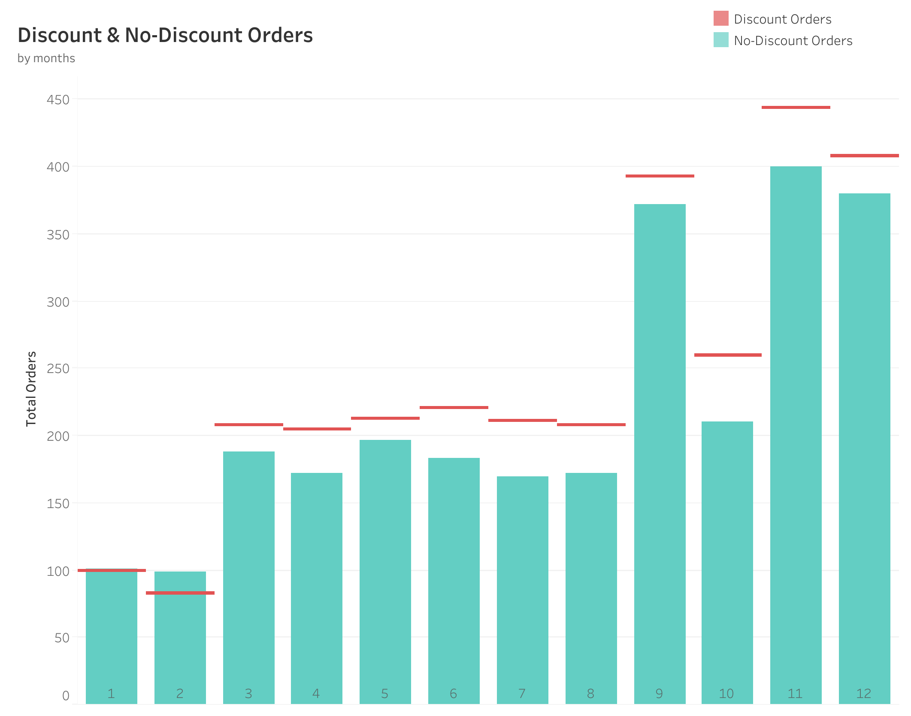
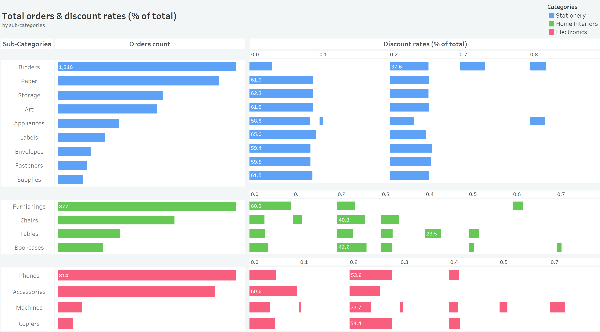

# Retail-Store-Data-Analysis
## Project Background
The data set used for this data analysis contains four years' sales records (2021 - 2024) of a retail store. The data is narrowed down to the USA only to present a comprehensive data analysis of this region & showcase its performance across key business metrics including sales, profits, shipment efficiency, customer retention, orders and discount impact. It features insights into sales growth trends, product performance, customer acquisition and shipment trends. It concludes with recommendations to enhance growth in sales, profits and customer retention.
## Executive Summary
Profit analysis for this store shows a steady increase year-over-year. However, the profit growth rate was at its peak in 2023 at 32%. Canon advanced copier, being the top product with the most profits, shows 225% more profit than the very next product in line, a plastic comb binding machine. The West and East regions remained the top two regions with the highest sales throughout the years. Their contributions are approximately 32% and 30% of the total sales, respectively. However, attracting new and retaining existing customers over the years remained difficult for the business. New and repeat customer ratios declined by 20% and 80% respectively, from the starting year. 
For a comprehensive business overview, you can explore the interactive Tableau dashboard <a href="https://public.tableau.com/views/RetailShop-ExecutiveSummary/ExecutiveSummary?:language=en-GB&:sid=&:redirect=auth&:display_count=n&:origin=viz_share_link">here</a>. <i>(link opens in the same tab)</i>

    

## Insights
### Profits & Sales
- The store earned around $300K in profits over the years with total sales of $2.3 million. The year 2023 was the best year for the business as it had its highest profit growth rate of 32%. However, it rapidly declined the very next year and settled at 14%.
- West and East regions remain the most profitable of them all. Collectively contributing a total of ~70% to overall profits.
- Business received the highest profits in Q4 of each year, probably because of the holiday season and festivities. Weaker returns are seen at the start of each year, i.e., Q1, except for the year 2024.
- Profits & Sales Performance Matrix shows that 17.6% of sub-categories drive high sales but low profits, while another 17.6% deliver low sales but high profits. Underperformers, mainly stationery items, make up 29.4% with both low sales and profits. Star performers (high sales & profits) dominate at 35.3%, led by electronics.
- Discounts tend to increase sales, but the business took a big hit on profits from its discounts. The average profit per order for discounted products is -$6.5 and $66.3 for products sold at the original price.

    

    
    

### Customer Growth & Retention
- New customer growth rate is declining steadily year-over-year. There is a slight recovery in new customer growth in the year 2023 (0.93%). The business can consider enhancing its marketing strategy and improving its conversion rate.
- Business has also seen a decline in repeat customer rate, consistently over the years. It declined from 31% in 2021 to 59% in 2024. Reasons could be customer dissatisfaction, lack of re-engagement strategies, or increased competition.
- Business has not introduced an incentive program for its customers. It can use various KPIs, such as the customer with the most sales or profit per quarter or year.
- Business can also introduce a loyalty program to customers who are buying frequently. Many customers made multiple purchases each year. Such incentive-based programs form a sense of relationship between the business and the customer.

    

### Orders
- The order rate have seen growth each year, showing a spike of 27% in 2023 from 7%, the previous year. In 2024, the order growth rate was 28% but the profit growth rate was lower (at 14%) than 2023. This is because of high number of discounted orders (25% growth rate) in the year.
- West region has high profitability despite moderate AOV(Avg Order Value). Central has lower AOV and declining profits, suggesting performance issues in the region.
- Analysis of orders and profits shows that West region has highest orders & profits each year except for 2022. When orders were the highest but not the profit.
- The visual analysis reveals an upward-sloping trend line between total orders and profits, with a correlation coefficient of 0.82. This indicates a strong positive relationship, suggesting that as the number of orders increases, profits tend to increase as well.
- Comparison of disounted and non-discounted orders shows that except for January and February, number of discounted orders are significantly more than non-discounted orders. Giving us a hint that the business relies on discounts throughout the year except for the start of the year. 
  

  

  

### Shipment
- Most of the customers preferred to choose "Standard Class" as the shipment method across all regions for each year.
- Early shipments are observed only in Standard Class (69.7%) and Second Class (38.9%), while no other shipping methods record early deliveries. This suggests operational efficiency is skewed toward specific shipping modes, potentially creating inconsistent customer experiences across delivery options.
- The business needs drastic improvement in it's shipping process. Data shows that between 25% and 28% of the orders are shipped late every year and it has increased in the last year. This weakens the positive impact of early shipment percentage (~50% yearly). Each region is showing increase in late shipment, atleast for the last year of the business, 2024.
- There is an enormous difference in shipping efficiency among various shipping methods. Business has seen between 84% to 77% orders shipping late for "First Class" shipping method throughout the four(4) years and between 2% to ~6% for "Same day" method. The other two shipping methods i.e. Standard & Second class, are in between.
- 

  

  

### Products
- Sales for the three categories i.e. electronics, home interiors and stationery, are quite close to one another. The most contribution is by electronics at 36.4%, followed by home interiors (32.3%) and stationery (31.3%).
- More than half of the products in the data belong to the stationery category (57%). However, electronics make half of the overall profit (50.7%).
- The business is launching fewer new products each year in any category, with most falling in the bottom 50% of sales, except one in the electronics category. This reliance on older products may stabilize sales, it also underscores the need to boost innovation and marketing for new products to reap sales benefits in the years to come.
- The products portfolio is weighted toward Growth-stage products (30%), signaling expansion potential, while a sizable share is in Decline or Discontinued stage (38%), highlighting risk of product churn. Reactivated items (17%) show promise but the low Maturity share (2%) suggests limited long-term stability. Nearly 10% unclassified products indicate gaps in lifecycle visibility.
- Many products sell strongly without discounts. However, the 20% discount consistently drives higher order volumes across categories. This suggests an optimal balance between boosting sales and maintaining profitability. Deep discounts of 50% and more, appear in each category. This signals weak demand or inventory issues, which raises the risk of margin erosion.

    

    

    

### Recommendations
#### Products
- Focus on margin improvement for high-sales/low-profit sub-categories, streamline or reposition underperformers, and continue investing in electronics and other star performers to sustain growth.
- Reassess discounting policies by limiting deep discounts to slow-moving inventory only and prioritize margin-protection strategies on strong sellers. Introduce data-driven, targeted promotions to boost sales without eroding overall profitability.
- Prioritize scaling Growth products, review Decline/Discontinued items for pruning or repositioning, and strengthen monitoring of reactivated and unclassified products to capture hidden opportunities.
- Limit unnecessary discounts on products with proven no-discount demand to protect profitability.
- Standardize the 20% discount level as a benchmark for promotional campaigns.
- Evaluate logistics processes for First Class and Same Day shipping to identify bottlenecks and explore strategies to standardize early or on-time deliveries across all shipment modes."
### Caveats
- The dataset does not explicitly distinguish between new and existing products. For this analysis, products were classified as “new” in the year of their first recorded order. This approach assumes that the year of first order of a product is the introduction year of that product, which may not always reflect the actual launch year.

